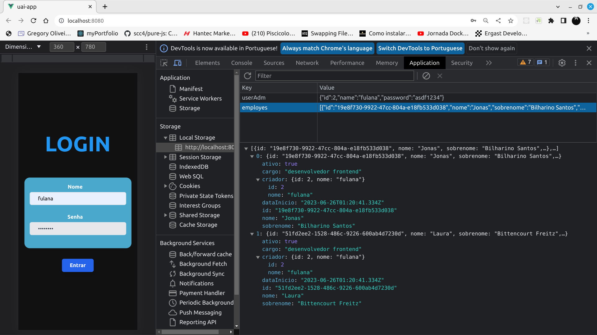
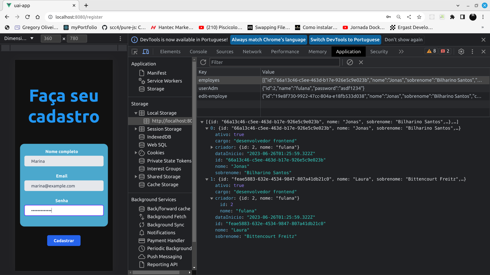
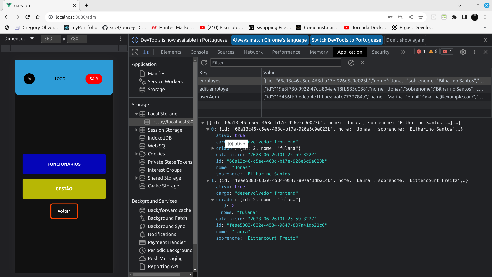
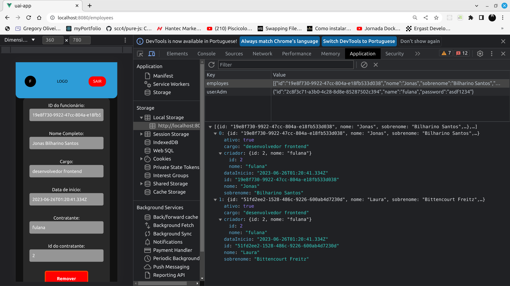
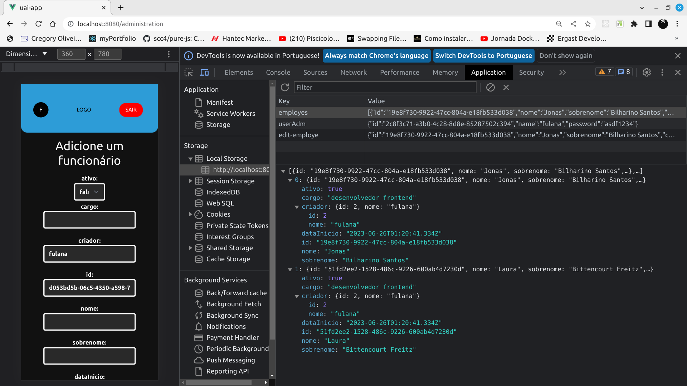

# User Admin Interface Application


This is the User Admin Interface, an application designed to manage employees.
<br></br>

## Access flow

> Access with default user

<br></br>
<br></br>

> Access through admin user registration


- Tasks management screen, notice that the navbar has an icon with the first letter of the logged in administrator username. This icon will serve to implement a sidbar showing all information of the administrator user.
<br></br>
<br></br>

## Management flow


> Screen that shows all the users and that allows the removal regarding the edition (by clicking on which field that shows their information) of an employee

<br></br>
<br></br>

> User edit screen. The editing flow consists of clicking on the button that grants permission to change the employee's data, change the necessary data and save.
> warning: some fields such as id cannot be changed, they are implemented automatically to prevent errors

<br></br>
<br></br>


## Project setup
```
npm install
```

### Compiles and hot-reloads for development
```
npm run serve
```

### Compiles and minifies for production
```
npm run build
```

### Lints and fixes files
```
npm run lint
```

### Customize configuration
See [Configuration Reference](https://cli.vuejs.org/config/).
